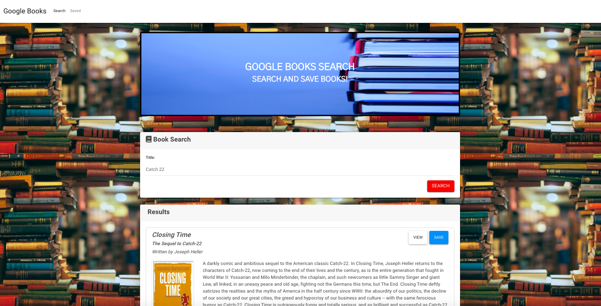
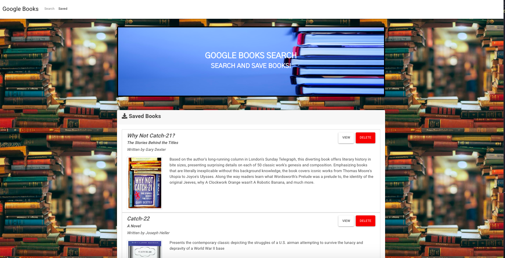

# Google Books Search

## Overview
This single-page application (SPA) uses React lifecycle methods and the Google Books API to query and display books based on user searches. Using Node, Express, and MongoDB users can save books to review or purchase later. Explore this application to find, view, and save your favorite books!

### Usage:
Search the name of a book to receive information on the following fields:
* title - Title of the book from the Google Books API
* authors - The books's author(s) as returned from the Google Books API
* description - The book's description as returned from the Google Books API
* image - The Book's thumbnail image as returned from the Google Books API
* link - The Book's information link as returned from the Google Books API

Control your book library by saving books you may be interested in for later viewing! 

### Installation:
1. Clone the complete repository from Github.
2. Run `npm install` in the terminal. This will install the required dependencies in the `package.json`. When that's done, you can run the application in the command line with `npm start` to start the React App and Express server. This will open the link to the application in your web browser at http://localhost:3000.

### Technology Used:
* React.js
* HTML5
* CSS3
* Node.js
* Express
* MongoDB
* Mongoose
* Javascript
* React-Router-Dom
* Axios
* ES6
* Bootstrap
* Various NPM packages

#### Application Organization:
This application has two routes accessible to the user. These are:
* Search
  * User can search for books via the Google Books API and render them here. User has the option to "View" a book, linking them to the book on Google Books, or "Save" a book, saving it to the Mongo database and showing it available on the "Saved" page.

* Saved
  * Renders all books saved to the Mongo database. User has an option to "View" the book, linking them to the book on Google Books, or "Delete" a book, removing it from the Mongo database and from view.
  
 These Express routes are available:

* /api/books (get) - Returns all saved books as JSON.
* /api/books (post) - Used to save a new book to the database.
* /api/books/:id (delete) - Used to delete a book from the database by Mongo _id.
* `*` (get) - Loads HTML page in client/build/index.html.

This application has its UI broken into components using React. The components are as follows:
* Book
* Card
* Footer
* Grid
* Jumbotron
* List
* Nav

This application follows an MVC paradigm to develop the user interface and divide the model (data), the view (user interface), and the controller (processes that handle input) structurally.

#### About Using React:

In the project directory, you can run:

#### `npm start`

Runs the app in the development mode. 
Open [http://localhost:3000](http://localhost:3000) to view it in the browser.

The page will reload if you make edits. 
You will also see any lint errors in the console.

#### `npm test` 

Launches the test runner in the interactive watch mode. 
See the section about [running tests](https://facebook.github.io/create-react-app/docs/running-tests) for more information.

#### `npm run build`

Builds the app for production to the `build` folder. 
It correctly bundles React in production mode and optimizes the build for the best performance.

The build is minified and the filenames include the hashes. 
Your app is ready to be deployed!

#### Screenshot:

#### Deployed Link: 
[Google Books Search](https://googlebooks-adi868.herokuapp.com/)

---
© 2019 Adina Cianciotto adi868
